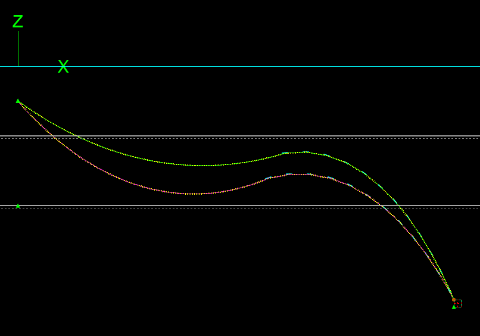
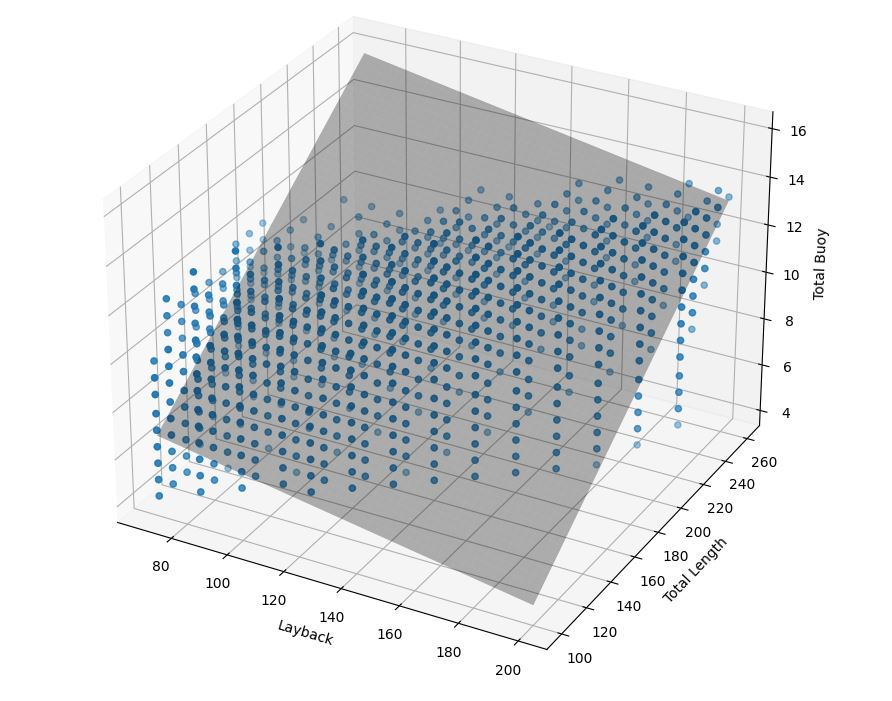
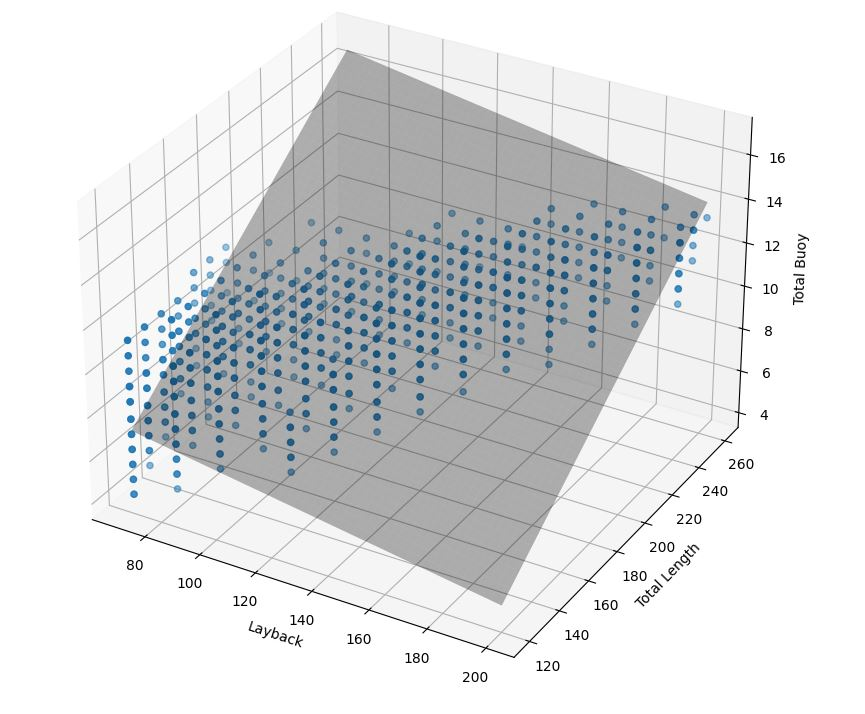
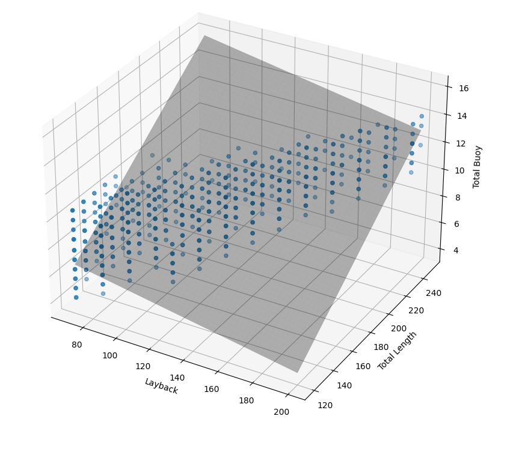
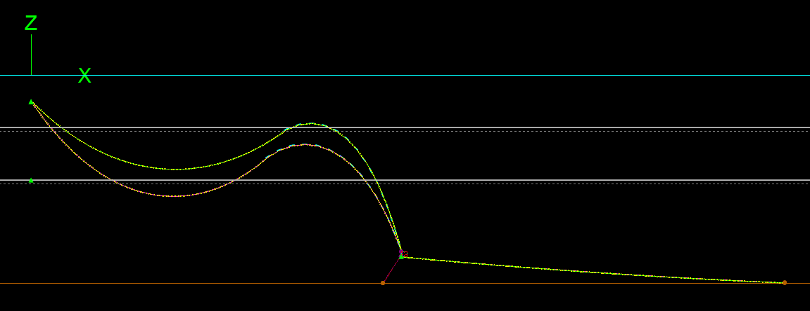
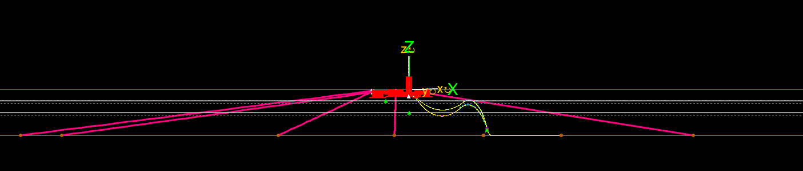
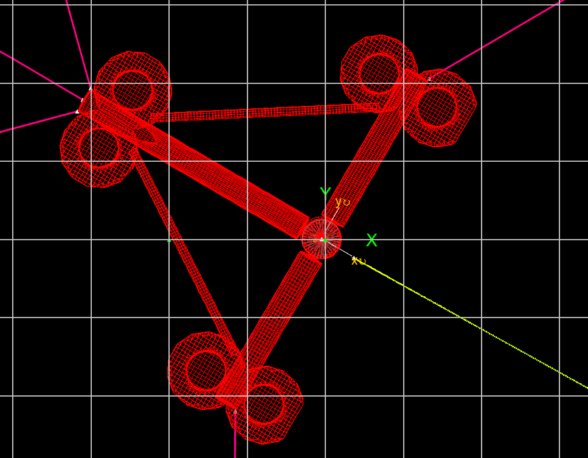

Test Run (Tutorial 1)
=====================

Here is a show case for how the workflow of CABLEX looks like and the detailed explanation and 
case settings is shown as follows:

Loading Space 1
---------------

The aim of LS1 is to find out the basic green zone for lazywave configurations design with no offsets(Norminal),

**Details of LS1**
::

    LazyWave
    Static
    Nominal 
    No offsets
    No current

For a lazywave shape, the following Design Space Parameters is considered,

**Details of DS1**
::

    Layback:            70m:200m:10m
    Total Length:       100m:260m:10m
    Buoy Numbers:       6:21:1 (6,000kg:21,000kg)
    Buoy C to C:        4m, 5m
    1st Buoy Dis:       3m

1. **BASE MODEL CREATION:** Create the base model based on the client/TFMC engineers specifications, the base model 
for the show case is based on the 800mm Copper Cable and 1000kg Buoy as a shown case, Detailed info presented as follows,

::

    Power cable property 	 	        800mm2 Cu
    Outside diameter [mm]		187.6(SOL)       287.6 (EOL)
    Mass in air [kg/m]		        47.68(SOL)       97.13 (EOL)
    Weight in sea water [N/m]	        439.4(SOL)        NA (EOL)

    Buoy property
    Mass of one buoy	Mb [kg]	        746.56(SOL)      704.30(EOL)
    Net Buoyancy of 1 module	[kg]	1000.0(SOL)      1050(EOL)
    Buoy outer diameter	Db [mm]	        1250.00(SOL)     1250.00(EOL)

The base model **LW_800mm_ESOL.yml** for test run can be accessed by using the following path,

.. code-block:: bash

   cd NEV\Floating Offshore Wind\05 Software\CABLEX\CodeSource

2. **MODEL ITERATION**: Download the **pc_conf_LS1.py**, make sure the python file and base model are in the same 
folder, open the VS terminal to the exact file path where above two files locates. Achieve case iteration/multiply work 
for Nominal Position with SOL/EOL Properties.

.. code-block:: bash

    python pc_conf_LS1.py

The case will be generated automatically with screen showing what the case generating now with layback showing. The scripts will be ending with the infomation 
for all generated cases, for **Length Failed** case, refers to the total length is smaller than the minimum line length at given laybacks while 
**Buoy_L Failed** ones referst to the buoy length is large than 2/3 of the total length which is not acceptable for Power Cable Design. Those information will
also be saved into data.txt file, For Example

::

    End of the batch
    Total number of models created:  4664
    Total number of Length Failed models:  2182
    Total number of Buoy_L Failed models:  294
    Time :  2024-02-05 11:39:28.744989
    Elapsed time : 579.515625 0.421875
    Total elapsed time: 579.09375 [s]

You now got all the simulation files with **DS1 & LS1** 

3. **SIMULTAIONS & POST PROCESSING**: download the **post_calculation_CABLEX_LW.py** from the aforementioned path, copy the file to the same directory where the case file generated.
Open **Orcaflex** batch processing reload all the case file and simulate the case, the post-processing results will be automatically shown as soon as the static simulation is finalised.

Run **dataSum_static.py** to summarise all the data file used for visualisation in CABLEX UI, you will get two seperate files with all data,

::

    Nominal_SOL_LS1.txt
    Nominal_EOL_LS1.txt

4. **VISUALISATION**: Transfer the results file from LS1 to the **CABLEX.exe** located directory, ususally the data is saved under the following path for the show case

.. code-block:: bash
    cd ./Pentlandstatics

double click **CABLEX.exe**, you will be able to see the knowledge and data base based on the LS1 site conditions

5. **SPECIFY PASS CASE**: Click **export pass case** button at CABLEX UI and saved it to the directory for LS2 simulations, make sure the file name is **allpass.txt**, 
a screenshot of the pass cases is shown as follows,

The Pass Case basic filter is SAG/HOG is set as 10% clearance with SB and SWL. Now you have all the lazywave configuration prepared for the LS2 simulations. 

Loading Space 2
---------------

The aim of LS2 is to find out the refined green zone for lazywave configurations design with offsets(N/F/C), the offsets is set as 30% of water depth,

**Details of LS2**
::

    LazyWave
    Static
    Nominal  
    Near/Far/Cross offsets
    No current

For a lazywave shape, the following Design Space Parameters is considered,

**Details of DS2**
::

    Pass cases from DS1 & LS1

1. **BASE MODEL CREATION**: The Base model for LS2 & DS2 is identical with previous stage **LW_800mm_ESOL.yml**

2. **MODEL ITERATION**: Download the **pc_conf_LS2.py** and achieve case iteration/multiply work 
for Nominal Position with SOL/EOL Properties.

.. code-block:: bash

    python pc_conf_LS2.py

Different with LS1, you will have four different folders once you created the models, i.e., Nominal Near Far Cross

3. **SIMULTAIONS & POST PROCESSING**: Put all case dat files in Orcaflex batch processing and make sure **post_calculation_CABLEX_LW.py** is in every
directory, Run **dataSum_static.py** to summarise all the data file used for visualisation in CABLEX UI, you will get eight seperate files with all data,

::

    Nominal_SOL_LS2.txt
    Nominal_EOL_LS2.txt
    Near_SOL_LS2.txt
    Near_EOL_LS2.txt
    Far_SOL_LS2.txt
    Far_EOL_LS2.txt
    Cross_SOL_LS2.txt
    Cross_EOL_LS2.txt

4. **VISUALISATION**: Transfer the results file from LS2 to the **CABLEX.exe** located directory, ususally the data is saved under the following path for the show case
double click **CABLEX.exe**, you will be able to see the knowledge and data base based on the LS2 & DS2

5. **SPECIFY PASS CASE**: Click **export pass case** button at CABLEX UI and saved it to the directory for LS3 simulations, make sure the file name is **allpass.txt**, 
a screenshot of the pass cases is shown as follows, the **Passed** Configuration is based on different offset results known as a multi-filtering process.

Ready to pass the configuration to LS3 now.

Loading Space 3
---------------

The aim of LS3 is to find out the more refined green zone for lazywave configurations design with offsets(N/F/C) and currents, the offsets is set as 30% of water depth, 
the current is set as 50-y return period current speed

**Details of LS3**
::

    LazyWave
    Static
    Nominal  
    Near/Far/Cross offsets
    Current 

For a lazywave shape at LS3, the following Design Space Parameters is considered,

**Details of DS3**
::

    Pass cases from DS2 & LS2

1. **BASE MODEL CREATION**: The Base model for LS3 & DS3 is identical with previous stage **LW_800mm_ESOL.yml**

2. **MODEL ITERATION**: Download the **pc_conf_LS3.py** and achieve case iteration/multiply work.

.. code-block:: bash

    python pc_conf_LS3.py

3. **SIMULTAIONS & POST PROCESSING**: Put all case dat files in Orcaflex batch processing and make sure **post_calculation_CABLEX_LW.py** is in every
directory, Run **dataSum_static.py** to summarise all the data file used for visualisation in CABLEX UI, you will get eight seperate files with all data,

::

    Nominal_SOL_LS3.txt
    Nominal_EOL_LS3.txt
    Near_SOL_LS3.txt
    Near_EOL_LS3.txt
    Far_SOL_LS3.txt
    Far_EOL_LS3.txt
    Cross_SOL_LS3.txt
    Cross_EOL_LS3.txt

4. **VISUALISATION**: Transfer the results file from LS3 to the **CABLEX.exe** located directory, ususally the data is saved under the following path for the show case
double click **CABLEX.exe**, you will be able to see the knowledge and data base based on the LS3 & DS3

5. **SPECIFY PASS CASE**: Click **export pass case** button at CABLEX UI and saved it to the directory for LS3 simulations, make sure the file name is **allpass.txt**, 
a screenshot of the pass cases is shown as follows, the **Passed** Configuration is based on different offset and current results. Only the configuration withstand all the 
offset and current can diliver to the next stage.

6. **NOTES**: Since LS4 is making a RPW cable configuration based on the LS3 pass results, therefore only very few configuration can be passed to the next stage, those cases 
are selected based on the **fitness factor** (calculated based on curvature, tension, buoy length, total length, hog clear etc). As a show case, only the best configuration considered
to pass to the next step:
::

    Layback: 140m; TotalLength: 180m; Buoy: 15(10.6 uplift); Buoy_CC: 5m; 1st Buoy: 3m

Loading Space 4
---------------

The aim of LS4 is to switch from a Lazywave configuraiton to real design RPW cable configuration (Reverse-Plaint Wave configuraiton) with the introduction of 
**Tether Clamp & Lower Catenary**, the current and offsets is also introduced in the process, offsets is set as 30% of water depth, while the current refers
as 50-y return period current speed, 

**Details of LS4**
::

    Reverse-Plaint Wave
    Static
    Nominal  
    Near/Far/Cross offsets
    Current 

All RPW configuration(2nd Loop) is set up based on the previous lazywave configruation which fit the best scope of the clients need. Therefore, new parameters
are introduced to model the updated power cable system. The details of DS4 parameters is set as follows.

**Details of DS4**
::

    LazyWave few Pass cases from DS3 & LS3
    Tether Anchor : 131m: 134m: 1m
    Tether Length : 8m: 13m: 1m
    Lower Catenary Anchor: 285m
    Lower Catenary Length: 145:155m:1m

1. **BASE MODEL CREATION**: An updated base model should be set up manually, i.e., **LW_800mm_ESOL_RPW.yml**  get it from,

.. code-block:: bash

   cd NEV\Floating Offshore Wind\05 Software\CABLEX\CodeSource

2. **MODEL ITERATION**: Download the **pc_conf_LS4.py** and achieve case iteration/multiply work 

.. code-block:: bash

    python pc_conf_LS4.py

Nominal Near Far Cross four folder will be created in LS4

3. **SIMULTAIONS & POST PROCESSING**: Put all case dat files in Orcaflex batch processing and make sure **post_calculation_CABLEX_RPW.py** is in every
directory, Run **dataSum_static.py** to summarise all the data file used for visualisation in CABLEX UI, you will get eight seperate files with all data,

::

    Nominal_SOL_LS4.txt
    Nominal_EOL_LS4.txt
    Near_SOL_LS4.txt
    Near_EOL_LS4.txt
    Far_SOL_LS4.txt
    Far_EOL_LS4.txt
    Cross_SOL_LS4.txt
    Cross_EOL_LS4.txt

4. **VISUALISATION**:  Need to updated the UI for DS4 & LS4 visualisation (SKIPPING)

5. **SPECIFY PASS CASE**: Similiar with LS3, fitness function is utlised to select the case with best performance form the previous loading space to the 
following one, i.e., the case with the lowest fitness factor is selected to run the full dynamic analysis together with tetrasub platfrom.

Loading Space 5
---------------

The aim of LS5 is to run full dynamic analysis with the client specified FOWT motion data with 12 conditions (wind/wave/current combination), similarly the model 
is to introduce a RPW cable configuration together with the floater and test it with client provided time series data. 

**Details of LS5**
::

    Reverse-Plaint Wave with  Floater
    Dynamic
    Time series motion data (wave/wind/current misalignment)

All RPW configuration(2nd Loop) is set up based on the previous lazywave configruation which fit the best scope of the clients need. Therefore, new parameters
are introduced to model the updated power cable system. The details of DS4 parameters is set as follows.

**Details of DS5**
::

    DS1-DS4 parameters
    RPW layouts

1. **BASE MODEL CREATION**: 

2. **MODEL ITERATION**: 

3. **SIMULTAIONS & POST PROCESSING**: Put all case dat files in Orcaflex batch processing and make sure **post_calculation_CABLEX_dynamic_RPW.py** is in every
directory, Run **dataSum_static.py** to summarise all the data file used for visualisation in CABLEX UI, you will get eight seperate files with all data,

::

    Nominal_SOL_LS5.txt
    Nominal_EOL_LS5.txt
    Near_SOL_LS5.txt
    Near_EOL_LS5.txt
    Far_SOL_LS5.txt
    Far_EOL_LS5.txt
    Cross_SOL_LS5.txt
    Cross_EOL_LS5.txt

4. **VISUALISATION**:  

5. **SPECIFY PASS CASE**: 

