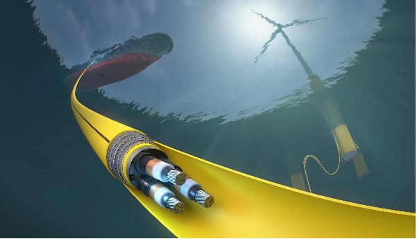

.. CABLEX documentation master file, created by
   sphinx-quickstart on Tue Jan  9 10:15:50 2024.
   You can adapt this file completely to your liking, but it should at least
   contain the root `toctree` directive.

Welcome to CABLEX's documentation!
==================================
.. only:: html

   :Version: v1.3.0
   :Date: |today|
   :Author: Yang Zhou 

CABLEX is an automated FOWT mooring line and power cable optimisation tool developed by the contractor at 
TFMC & University of Strathclyde. It is specifically designed to design and optimise power cable configurations in 
FOWT projects. Seamlessly integrating with TFMC established methodology, this software encompasses thousands of power 
cable base configurations and includes design load cases in its routine. Noteworthy for its user-friendly interface, 
CABLEX offers advanced static/dynamic analysis features and flexible criteria ranges, making it a convenient 
tool for preliminary and detailed design checks. It stands out as a pioneering solution in the renewable energy sector. 

Documentation Directory
=======================

.. toctree::
   :maxdepth: 2
   :caption: Introduction:

   introduction

.. toctree::
   :maxdepth: 2
   :caption: Installation:

   download
   cablex-installation
   linked-libraries

.. toctree::
   :maxdepth: 2
   :caption: Methodology:

   problem-statement
   case-generation
   cable-modelling
   simulation
   post-processing
   visualisation
   fitness-function

.. toctree::
   :maxdepth: 2
   :caption: Quick Start:

   basic-operation

.. toctree::
   :maxdepth: 2
   :caption: Key Features:

   key-features

.. toctree::
   :maxdepth: 2
   :caption: Release Notes:

   release-note

.. toctree::
   :maxdepth: 2
   :caption: Contact:

   contact

   

