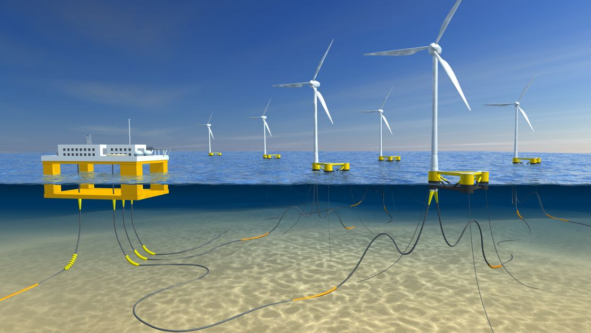

.. CABLEX documentation master file, created by
   sphinx-quickstart on Tue Jan  9 10:15:50 2024.
   You can adapt this file completely to your liking, but it should at least
   contain the root `toctree` directive.

Welcome to CABLEX's documentation!
==================================
.. only:: html

   :Version: v1.2.0
   :Date: |today|

CABLEX is an in-house automation tool developed by the CONTRACTOR at TFMC & University of Strathclyde. 
It is specifically designed to design and optimise power cable configurations in FOWT projects. Seamlessly 
integrating with TFMC established methodology, this software encompasses over 10,000 power cable base 
configurations and includes design load cases in its routine. Noteworthy for its user-friendly interface, 
CABLEX offers advanced static/dynamic analysis features and flexible criteria ranges, making it a convenient 
tool for preliminary and detailed design checks. It stands out as a pioneering solution in the renewable energy sector. 
Figure 1 illustrates the workflows for the tool, which is initiated from Client/TFMC inputs and returns with an optimized configuration.

.. image:: _static/workflow.jpg
   :alt: CABLEX
   :width: 400px
   :height: 300px

**Documentation Directory**

Contents
--------

.. toctree::
   :caption: Overview:

   introduction

Installing
----------

.. toctree::
   :maxdepth: 2
   :caption: Installation Guide:

   install

Usage
-----

.. toctree::
   :maxdepth: 2
   :caption: Usage Instructions:

   tutorial

Indices and tables
==================

* :ref:`genindex`
* :ref:`modindex`
* :ref:`search`
