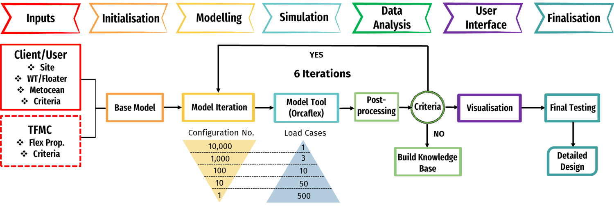

Problem Statement
=================

To examine the best cable configuration from a given clinets specifications, or the knowledgebase under the provided sites
metocean data. The work flow of CABLEX is shown as follows.

Typically, seven stages are presented to assist us in achieving a better configuration. It begins with documentation of client/TFMC engineers' specifications, 
On the client side, including site conditions, RNA and floater geometries, gross properties, metocean data, and client specifications. TFMC engineers will 
also be provided with information on buoy, cable, clamp, bend stiffener types, along with installation cost requirements.

Power Cable Configuration:
		    
		Fairlead
	      |\         Hog
	      | \        /~\~ Buoy
	   	  |  \      /~  \~
          |   \    /~    \~   TotalLength(PC)
	   	  |    \  /       \
	   	  |     \/         \
	      |    Sag          \  Hang-off  
	 _____|________________________________ 
              LayBack      

Genseveral loading space 

Figure 1 illustrates the workflows for the tool, which is initiated from Client/TFMC inputs and returns with an optimized configuration.

